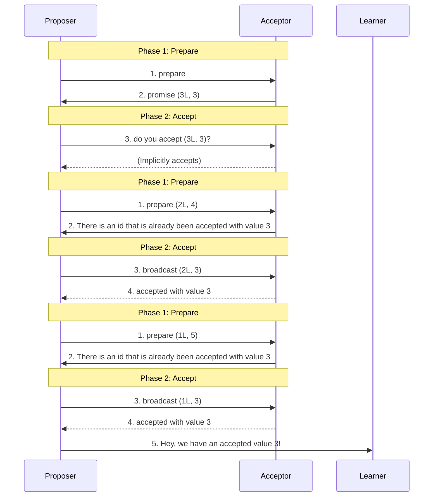
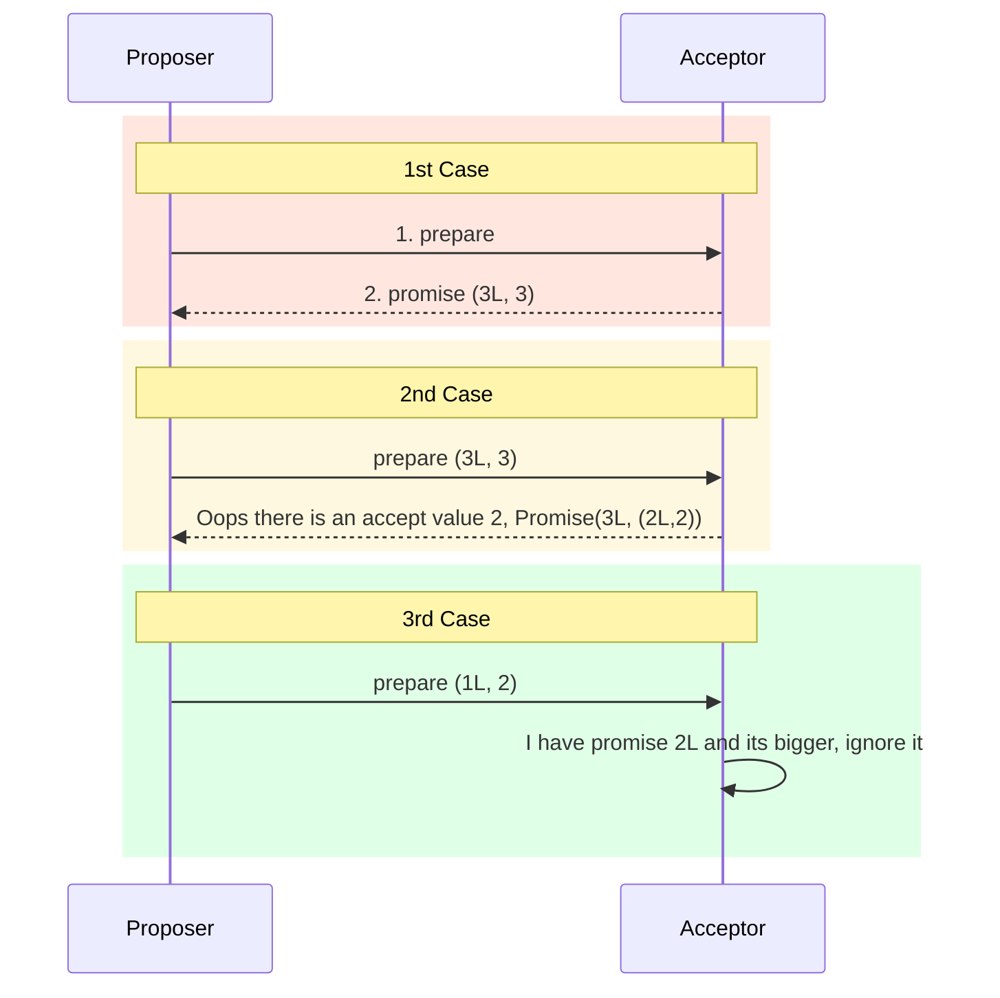
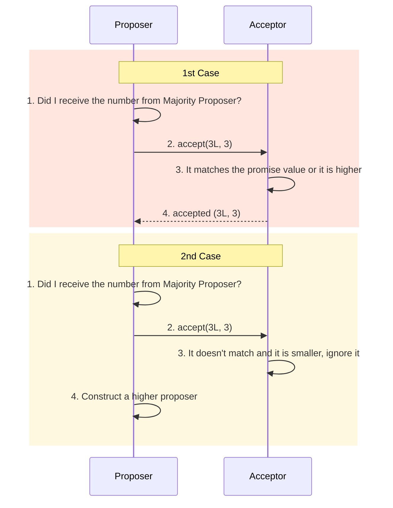

### Why Paxos?

Paxos is a Greek island in the Ionian Sea, lying just south of Corfu. I've never been, but I read extremely positive things. Now, the Paxos family of protocols, designed for solving consensus in a network of unreliable processors, was named after that small island, some miles of Greece's west coast. This name choice is attributed to Leslie Lamport, the creator of the Paxos protocol. There's an interesting backstory to this naming.

Lamport initially presented the protocol in a paper titled *"The Part-Time Parliament"* which was written in a parable-like style. In this paper, he described a fictional parliament on the island of Paxos, which had developed a highly reliable way of reaching consensus despite the fact that its members were frequently absent. This allegorical presentation was intended to make the concepts of the protocol—which involves complex mechanisms for ensuring that a network of nodes can agree on a single value despite failures—more understandable and engaging.

The narrative style of the original paper, however, initially led to the protocol being not taken as seriously as Lamport had hoped. It took some time for the computer science community to appreciate the elegance and robustness of the Paxos protocol, which is now considered a fundamental contribution to the field of distributed systems.

### Reinventing the parable

Imagine you're part of a football team. Following practice, the team enjoys dining out together. Typically, the team debates between pizza and burgers. You prefer everyone choosing the same dining spot post-practice for a more enjoyable experience. Thus, there's a need for consensus on the field about the dining choice – be it burgers or pizza.

However, a challenge arises: _the coach left early._ Post-practice fatigue and hunger make the team easily distracted, desiring a quick decision. Additionally, shouting over the team's loud discussions at the field won't work; your suggestions could be drowned out. You might think: 

> Peer-to-peer (or person-to-person) communication is the sole method to reach a unanimous decision.

This scenario mirrors challenges in distributed systems, where numerous servers must agree on common events or information in an asynchronous setting.

Paxos, an early paper on distributed consensus algorithms, involves multiple rounds to help servers agree on a value proposed by a group member. This algorithm employs peer-to-peer communication, with each peer playing one of three roles: *proposer*, *acceptor*, or *learner*. These roles can coexist on a single server, meaning a server can _simultaneously_ be a proposer, acceptor, and learner.

Returning to the football analogy, for simplicity, let's separate these roles: half the team as proposers, a quarter as acceptors, and a quarter as learners.

Proposers suggest dining locations to acceptors, who evaluate these suggestions based on certain criteria. Once an acceptor favors a majority of proposals, they inform the learner.

For example, if an acceptor favors burgers, they notify the learner that the team majority prefers burgers. Interestingly, another acceptor might favor pizza, informing the learner of a preference for pizza.

It's then up to the learner to announce the team's majority choice based on acceptors' messages. The algorithm continues through multiple iterations until the learner declares a consensus.

### Foreword

We won't discuss the "why" and the steps the algorithm goes through to reach consensus. If you are interested in why the Paxos Algorithm works, you can look at a great brief introduction in this [Google Tech Talk](https://www.youtube.com/watch?v=d7nAGI_NZPk).

Secondly, I assume that the proof and the theory works, and this article will be mainly about the implementation.

### Introduction

In the Paxos algorithm, three roles are crucial: the proposer, the acceptors, and the learner. 

- The proposer initiates the process by proposing a value, which they communicate to other group members through messages.
- Acceptors, upon receiving these proposals, decide whether to accept the proposed value.
- The learner's role is to ascertain whether the group has achieved consensus in a given round of the algorithm.

Paxos operates through two distinct phases: the prepare phase and the accept phase, as outlined below:



### Prepare phase

Proposers within each group select a unique proposal number and dispatch a preparatory request to the acceptors within the system. It is not necessary for every acceptor to receive this message; a majority—or a quorum—will suffice for the algorithm to advance.

Upon receipt of the request, an acceptor will evaluate it against the highest proposal number it has encountered thus far. Should the new proposal's number exceed the current highest, the acceptor will acknowledge its superiority and respond with a positive message, indicating, "I acknowledge that your proposal number is greater than any I have previously recorded, and I will therefore consider it."

In instances where the acceptor has already committed to a proposal, its response will be similar but with an addition, "While your proposal number is greater, I have already committed to a proposal. I will include the number and value of that proposal in my response."

Should an acceptor receive a proposal bearing a number less than the highest it has already considered, it will disregard the proposal outright.



### Accept Phase

When a proposer garners a promise from the majority, it scrutinizes the responses for any acceptances. If an accepted message is present, the proposer adopts the message and reissues the acceptance request to the acceptors.

If the proposer fails to secure a response from a majority of the acceptors to whom it has broadcasted its proposal, it infers that the proposal number was insufficiently high. Consequently, the proposer formulates a higher proposal number and redistributes it to the acceptors.

Upon receiving affirmative replies from a majority of the acceptors, the proposer notifies the learner that consensus has been achieved.

Should an acceptor receive an acceptance request with a proposal number that matches its own promise, it will validate the proposer's value as accepted and communicate this confirmation back to the proposer.

Conversely, if an acceptor is presented with an acceptance request bearing a proposal number inferior to that of its prepared promise, the acceptor will disregard the request.

From the learner's perspective, the reception of a consensual value from the majority signifies that consensus has been established.




### Implementation

#### Constructing the models

At the heart of the Paxos algorithm lies the inter-node communication. Thus, it seems most natural to conceptualize each role as an object.

Given that the algorithm details the interactions among proposers, acceptors, and learners, employing an actor system emerges as the most straightforward approach for crafting the algorithm. This would involve establishing three distinct actors, each encapsulating their respective logic and state.

#### Immutability in the State Management

Implementing an inherently immutable system presents challenges since the algorithm demands continuous modifications to the internal state.

Object-oriented programming provides a framework for managing state changes within proposers, acceptors, and learners. Within each phase, state mutation can occur within the respective object instances.

For example, an instance of an acceptor could maintain a variable like `max_id` as part of its mutable state, updating this `max_id` upon receiving a prepare message with a superior id number.

#### Domain Models

Beginning with each of the domain models, the most straightforward method is to conceptualize what is required by the *proposer*, *acceptor*, and *learner*.

##### Proposer Models

The proposer will be composed of a value, a proposal number, and a quorum size. The proposal number must be unique and incrementally increasing. A typical method for generating this proposal number combines an identifier with a machine-specific ID to guarantee uniqueness.

```rust
use std::cmp::Ordering;

#[derive(Debug, Eq)]
struct ProposalId {
    uid: i64,
    machineId: i64,
}

impl Ord for ProposalId {
    fn cmp(&self, other: &Self) -> Ordering {
        if self.uid < other.uid {
            Ordering::Less
        } else if self.uid > other.uid {
            Ordering::Greater
        } else {
            self.machineId.cmp(&other.machineId)
        }
    }
}

impl PartialOrd for ProposalId {
    fn partial_cmp(&self, other: &Self) -> Option<Ordering> {
        Some(self.cmp(other))
    }
}

impl PartialEq for ProposalId {
    fn eq(&self, other: &Self) -> bool {
        self.uid == other.uid && self.machineId == other.machineId
    }
}

```

The quorum size is the number of nodes in the system.

##### Acceptor Model

The acceptor is composed of a potentially promised proposal number as well as the proposal number and value that it has agreed to. Given that these two elements may not always be present, it would be prudent to consider them as optional.

```rust
#[derive(Debug)]
struct Acceptor<V> {
    promise_id: Option<ProposalId>,
    maybe_accepted: Option<(ProposalId, V)>,
}
```

##### Learner Model

The learner is tasked with monitoring all the confirmations of acceptance it acquires and verifying whether the count of a particular value surpasses the majority threshold. It must maintain a mapping that correlates each accepted value with its occurrence frequency.

In this mapping, the accepted value serves as the key, while the associated count represents the value. Determining the majority requires the learner to be aware of the quorum size. Additionally, the learner must have a mechanism to select a value once it achieves a majority.

Consequently, the learner's attributes will include the quorum size, a record of the tally of accepted values to date, and the ultimately selected value once a majority is established.

```rust
use std::collections::HashMap;

#[derive(Debug)]
struct Learner<V> {
    quorum_size: i32,
    final_value: Option<V>,
    accepted_id_so_far: HashMap<V, i32>,
}
```

Typically, in object-oriented programming (OOP), functions are encapsulated within the model, and these functions directly mutate the model's state.

In a functional approach adapted for Rust, I have chosen to isolate these functions into a distinct object, named `Ops`, which interacts with the proposer. This separation of the model and its operations allows for a clearer division of concerns, particularly regarding state mutation.

#### Messages

We have four types of messages that are needed for each of the two-phase algorithm that we need to think about:

- `messagePrepare`
- `messagePromise`
- `messageAccept`
- `messageAccepted`

We can combine these messages in a `Message` **enum**.

```rust
#[derive(Debug)]
enum Message<V> {
    MessagePrepare {
        proposal_id: ProposalId,
        value: V,
    },
    MessagePromise {
        proposal_id: ProposalId,
        maybe_accepted: Option<(ProposalId, V)>,
    },
    MessageAccept {
        proposal_id: ProposalId,
        value: V,
    },
    MessageAccepted {
        proposal_id: ProposalId,
        value: V,
    },
}
```

We are using an `Option` type to embed the `AcceptedValue` in the `Accept` message since an `Acceptor` has, most likely, not accepted a proposal when responsing to a promise request.

#### Action

Implementing Paxos or similar consensus algorithms with pure functions encourages the consolidation of all IO-related side effects into a single component.

There are various strategies for relegating IO operations to the periphery of the system. A straightforward method involves transforming operations into values.

In this vein, our implementation will introduce an `Action` type. This `Action` type will serve as a value representing any non-pure side effects mandated by the protocol.

For example, in the context of Paxos, essential side effects include transmitting messages to other machines and processes. To accommodate this, the `Action` type will encompass functionalities like `Broadcast` and `Send`, which enable the proposer to communicate with either the acceptor or learner groups.


```rust
#[derive(Debug)]
enum BroadcastGroup {
    AcceptorsGroup,
    LearnersGroup,
}

#[derive(Debug)]
enum Action<V> {
    Send { msg: Message<V> },
    Broadcast { msg: Message<V>, broadcast_group: BroadcastGroup },
    Noop,
}
```

#### Message Handling

Upon isolating the algorithm's non-pure effects, we have to manage the core state of the algorithm without resorting to mutation.

Rust does not have a built-in `State` monad like in some functional languages. The idea is to have functions that take the current state and return a new state along with some result. This concept is akin to the `State` monad in functional programming, where a function takes a state, manipulates it, and returns a new state and a result.

For those unfamiliar with State monads, I recommend exploring foundational concepts in functional programming to grasp this approach.

Therefore, we can design functions in Rust that effectively take a `Proposer` and return a tuple `(Proposer, Action)`. This encapsulates the state transition without direct mutation.

To streamline the implementation, I have organized the operations into three distinct modules: `ProposerOps`, `AcceptorOps`, and `LearnerOps`. This division mirrors the separation of operations in actor systems or object-oriented designs, where each role's operations are contained within its respective module. Such a structure lends modularity and clarity to the code.

```rust
trait LearnerOps<V> {
    fn handle_accepted(&self, msg: MessageAccepted<V>) -> (Learner<V>, ());
    fn get_value(&self) -> (Learner<V>, Option<V>);
}

trait ProposerOps<V> {
    fn send_prepare_proposal(&self, message: MessagePrepare<V>) -> Action<V>;
    fn handle_promise(&self, messages: Vec<MessagePromise<V>>) -> (Proposer<V>, Action<V>);
    fn handle_accept(&self, messages: Vec<MessageAccepted<V>>) -> (Proposer<V>, Action<V>);
    fn construct_higher_proposal_id(&self, prev_proposal: Proposer<V>) -> Proposer<V>;
}

trait AcceptorOps<V> {
    fn handle_prepare(&self, msg: MessagePrepare<V>) -> (Acceptor<V>, Action<V>);
    fn handle_accept(&self, msg: MessageAccept<V>) -> (Acceptor<V>, Action<V>);
}
```

Let's take a closer look at the `handle_prepare` function. It takes an `Acceptor` and a `MessagePrepare` as arguments and returns a tuple containing the updated `Acceptor` and an `Action`. It matches on the `promise_id` of the acceptor and either returns the unchanged acceptor with a `Noop` action or updates the `promise_id` and returns a `Send` action with a `MessagePromise`. This function effectively represents the state transition for the `Acceptor` in response to a `MessagePrepare`

```rust
fn handle_prepare<V>(acceptor: Acceptor<V>, msg: MessagePrepare<V>) -> (Acceptor<V>, Action<V>) {
    match acceptor.promise_id {
        Some(proposal_id) if msg.proposal_id < proposal_id => (acceptor, Action::Noop),
        _ => {
            let new_acceptor = Acceptor {
                promise_id: Some(msg.proposal_id),
                maybe_accepted: acceptor.maybe_accepted,
                ..acceptor
            };
            let action = Action::Send(Message::MessagePromise {
                proposal_id: msg.proposal_id,
                maybe_accepted: new_acceptor.maybe_accepted,
            });
            (new_acceptor, action)
        }
    }
}
```

Most of the functions that are going to be used for handling and sending events would appear as follows:

```rust
fn handle<S, M, A>(state: S, message: M) -> (S, A);
```

- `S` represents the state type (e.g., `Proposer`, `Acceptor`, `Learner`).
- `M` represents the message type (e.g., `MessagePrepare`, `MessagePromise`, `MessageAccepted`).
- `A` represents the action type (e.g., `Action`).

```rust
fn send_proposal<S, V, A>(state: S, value: V) -> (S, A);
```

- `S` represents the state type (e.g., `Proposer`).
- `V` represents the value type associated with the proposal.
- `A` represents the action type (e.g., `Action`).

The approach we took renders the central logic of the algorithm state-independent – it remains unconcerned with the internal states and processes of each machine.

Pure state management has been established. This simplifies the testing and debugging of the algorithm. Crucially, the execution of the `Action` method can be delegated to external functions, which are responsible for invoking those side-effect operations outside the algorithm's scope.

### Epilogue

We've implemented the Paxos algorithm in a purely functional style. This task presents notable challenges, especially considering the inherently stateful nature of the algorithm as described in its original paper. The algorithm requires meticulous tracking of each state to achieve consensus.

However, our strategy involved bifurcating the algorithm into two distinct components – the impure functions and the core state management.

One of the most significant benefits of this separation between IO operations and core state management in the algorithm is the enhanced testability it offers, even in concurrent environments.

We strive to render the message handling logic as state-independent as possible. This means that each operation can be completed without relying on the internal states of any machine or process.
