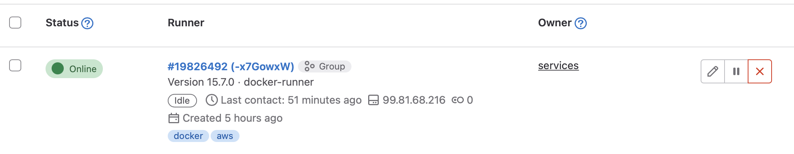

It was the best of times, it was the worst of times. On one hand, businesses needed the power and flexibility of cloud computing to meet the demands of the modern world. On the other hand, the cost of these services could be quite steep, leaving many to search for ways to save on their cloud expenses.

Enter AWS Spot Instances and Terraform. These two offer a unique solution for people looking to cut costs on their cloud infrastructure. With the ability to bid on spare compute capacity, there's no reason to pay the full price for spontaneous tasks. The latest company that I am involved with, is using the managed and free version of Gitlab to handle all of its version control needs. Gitlab is kind enough to offer 400 minutes of free CI/CD per month, and while generous, it is not enough to accommodate the needs of even the tiniest of startups. So, exploiting cheap pieces of cloud computing seems to be the way to go.

## Setting up a project

For the needs of this article, we will assume a flat directory structure for our root module. 

```
├── main.tf
├── providers.tf
├── eips.tf
├── instances.tf
├── network.tf
├── scripts
│   ├── install_docker.sh
│   └── install_runner.tpl
├── sg.tf
└── vars.tf
```
- `main.tf`: Root module configuration
- `providers.tf`: Providers' configuration
- `eips.tf`: Elastic IPs
- `instances.tf`: Instances and Spot Requests
- `network.tf`: VPC and network resources
- `scripts`: Script templates for provisioners
- `sg.tf`: Firewalling
- `vars.tf`: Variables


## Initiating the root module

We can initiate the root module of the project simply by declaring the required providers and configuring the Terraform backend.

For a production setup, choosing between either an S3 backend or a managed backend from Hashicorp would be the best choice, but for this piece of writing, going with the local filesystem as the backend is enough.


`main.tf`
```
terraform {
  required_providers {
    aws = {
      source  = "hashicorp/aws"
      version = "~> 4.0"
    }
  }
}

```

Setting up the AWS provider is straightforward and it will allow us to interact with the AWS API to manage resources. Authenticating against the API with the provider can happen in multiple ways, such as directly [adding the credentials to the provider's configuration block](https://registry.terraform.io/providers/hashicorp/aws/latest/docs#provider-configuration):

`providers.tf`
```
provider "aws" {
  access_key = "my-access-key"
  secret_key = "my-secret-key"
}
```

or by exporting the `AWS_ACCESS_KEY_ID` and `AWS_SECRET_ACCESS_KEY` variables as it's typical with almost all interactions with the AWS API.


The most important bit of configuration apart from configuring the credentials is letting the provider know with which region is going to interact. This can be achieved by adding the `region` argument in the `provider` block.

`providers.tf`
```
provider "aws" {
  region     = "us-west-2"
  access_key = "my-access-key"
  secret_key = "my-secret-key"
}
```

After configuring the module, running `terraform init` should succeed and Terraform will be ready to interact with the API.

## Creating the private network

We are launching all of our resources in a separate private network that we are isolating from other resources. Of course, one might decide to launch the runners' instances inside an existing network, for instance, the one that they deploy their development or operations resources.

Keeping some of the values in a separate file can help with doing quick changes in case we need to reprovision a network with a different CIDR block or move the subnets to a different range.

`vars.tf`
```
variable "vpc_cidr_block" {
  default = "10.10.0.0/16"
}

variable "public_subnet_cidr_block" {
  default = "10.10.0.0/24"
}

variable "public_subnet_az" {
  default = "eu-west-1a"
}
```


`network.tf`
```
resource "aws_vpc" "runners" {
  cidr_block           = var.vpc_cidr_block
  enable_dns_hostnames = true
  enable_dns_support   = true
  tags = {
    Name        = "runners"
    Environment = "ops"
  }
}
```

After creating the VPC we can start adding all the other resources that are going to allow entities appearing inside this VPC (e.g our runners' spot instances) to have internet access and proper firewalling.

`network.tf`
```
resource "aws_vpc" "runners" {
  cidr_block           = var.vpc_cidr_block
  enable_dns_hostnames = true
  enable_dns_support   = true
  tags = {
    Name        = "runners"
    Environment = "ops"
  }
}

resource "aws_subnet" "runners_public" {
  vpc_id            = aws_vpc.runners.id
  cidr_block        = var.public_subnet_cidr_block
  availability_zone = var.public_subnet_az

  tags = {
    Name        = "runners-public"
    Environment = "ops"
  }
}

resource "aws_route_table" "runners_public" {
  vpc_id = aws_vpc.runners.id

  tags = {
    Name        = "runners-public"
    Environment = "ops"
  }
}

resource "aws_route_table_association" "runners_public" {
  subnet_id      = aws_subnet.runners_public.id
  route_table_id = aws_route_table.runners_public.id
}

resource "aws_internet_gateway" "runners" {
  vpc_id = aws_vpc.runners.id

  tags = {
    Name        = "runners"
    Environment = "ops"
  }
}

resource "aws_route" "runners_public" {
  route_table_id         = aws_route_table.runners_public.id
  destination_cidr_block = "0.0.0.0/0"
  gateway_id             = aws_internet_gateway.runners_public.id
}
```

We are creating a public subnet for which we later configure an internet gateway and use the proper routing rules so that the VPC resources can access the internet.

## Adding firewall rules

Making sure that the instances are only communicating with entities that they are supposed to is important. Utilizing AWS's Security Groups concept we can define a set of rules that fit our use case. 

A good idea is to allow SSH access from the external IP block that we use to connect to instances for administration purposes so that we can debug if something goes wrong. For the runners, we don't need to configure any other type of ingress rules since they're pull-based.

`sg.tg`
```
resource "aws_security_group" "runner" {
  name        = "runner"
  description = "Allow all outbound traffic, allow ssh inbound traffic"
  vpc_id      = aws_vpc.podbeam_classic.id

  ingress {
    from_port        = 22
    to_port          = 22
    protocol         = "tcp"
    cidr_blocks      = ["0.0.0.0/0"] # or more specific for increased security
    ipv6_cidr_blocks = ["::/0"]
  }

  egress {
    from_port        = 0
    to_port          = 0
    protocol         = "-1"
    cidr_blocks      = ["0.0.0.0/0"]
    ipv6_cidr_blocks = ["::/0"]
  }

  tags = {
    Name = "runner"
  }
}
```

## Requesting spot instances

The common thing to do when launching a new instance, be it a spot or a classic one, is to select the image that is going to run in the host. To do that, we can take advantage of Terraform's querying abilities and use a data source of type `aws_ami` to get the ami id.

`instances.tf`
```
data "aws_ami" "ubuntu" {
  most_recent = true

  filter {
    name   = "name"
    values = ["ubuntu/images/hvm-ssd/ubuntu-focal-20.04-amd64-server-*"]
  }

  filter {
    name   = "virtualization-type"
    values = ["hvm"]
  }

  owners = ["099720109477"] # Canonical
}
```

I chose to go with a typical Ubuntu 20.04 image for an amd64 server. If it suits your workload you can choose to go with an arm image and the equivalent server type, since they're typically 40% cheaper.

`instances.tf`
```
data "aws_ami" "ubuntu" {
  most_recent = true

  filter {
    name   = "name"
    values = ["ubuntu/images/hvm-ssd/ubuntu-focal-20.04-amd64-server-*"]
  }

  filter {
    name   = "virtualization-type"
    values = ["hvm"]
  }

  owners = ["099720109477"] # Canonical
}

resource "aws_key_pair" "runner" {
  key_name   = "runner-${count.index}"
  public_key = "value"
}

resource "aws_spot_instance_request" "runner" {
  ami           = data.aws_ami.ubuntu.id
  spot_price    = "0.016"
  instance_type = "t3.small"
  spot_type     = "persistent"
  wait_for_fulfillment = "true"

  key_name  = aws_key_pair.runner.key_name
  subnet_id = aws_subnet.podbeam_classic_public.id
  vpc_security_group_ids = [
    aws_security_group.runner.id,
  ]

  tags = {
    Name = "runner-${count.index}"
  }
}
```

The `aws_spot_instance_request` will create a new Spot Request of the "persistent" type, meaning that if the instance is stopped or terminated it will try to find a new that meets the `spot_price` and `instance_type` requirements. The `wait_for_fulfillment` is set to `true` and it will hold refrain from moving on with the rest of the plan if the spot request has not been fulfilled.

We are also attaching the spot instance to the subnet that we created earlier, along with the security group.

It's also important to add a public key to the server so that we are able to manually connect to the box or use provisioners with Terraform. We are achieving that by taking advantage of the `aws_key_pair` resource and the `key_name` argument. The `public_key` argument of the `aws_key_pair` resource must contain a typical public key. You can get this from various locations, like a local file or a Vault secret or an AWS Secret Manager secret.

### Writing the bootstrapping scripts

We have to main components that we need for a fully functional Gitlab runner, the runner binary itself, and Docker. 

Inside the `scripts` folder we can create the `install_docker.sh` and the `install_runner.tpl`. We opt to go with a `tpl` extension for the latter because we need to interpolate a value before we execute it in the runner instance.


`install_docker.sh`
```bash
#!/bin/bash

# Update the package manager
sudo apt-get update

# Install dependencies
sudo apt-get install -y \
  apt-transport-https \
  ca-certificates \
  curl \
  gnupg-agent \
  software-properties-common

# Add Docker's GPG key
curl -fsSL https://download.docker.com/linux/ubuntu/gpg | sudo apt-key add -

# Add the Docker repository
sudo add-apt-repository \
   "deb [arch=amd64] https://download.docker.com/linux/ubuntu \
   $(lsb_release -cs) \
   stable"

# Update the package manager again
sudo apt-get update

# Install Docker
sudo apt-get install -y docker-ce docker-ce-cli containerd.io

# Add the current user to the docker group
sudo usermod -aG docker $USER

# Start the Docker daemon
sudo systemctl start docker

# Enable the Docker daemon to start at boot
sudo systemctl enable docker
```


`install_runner.tpl`
```
#!/bin/bash

# Add the GitLab Runner package repository
curl -L https://packages.gitlab.com/install/repositories/runner/gitlab-runner/script.deb.sh | sudo bash

# Install GitLab Runner
sudo apt-get install gitlab-runner

# Register the runner
sudo gitlab-runner register \
  --non-interactive \
  --url "https://gitlab.com/" \
  --registration-token "${registration_token}" \
  --executor "docker" \
  --docker-image alpine:latest \
  --description "docker-runner" \
  --maintenance-note "Free-form maintainer notes about this runner" \
  --tag-list "docker,aws" \
  --run-untagged="true" \
  --locked="false" \
  --access-level="not_protected"
```

We are interpolating the `registration-token` value, but it would also be wise to replace the `url` in case you're not using the managed version of Gitlab, but rather a self-hosted instance.

We went with a per-group runner, so we grabbed the registration token from a certain Gitlab group, but you can do per-project runners as well. It's up to you to decide.

Now, using the `template_file` data source we can interpolate the values of our choice in the `install_runner.tpl` file.

`instances.tf`
```
data "aws_ami" "ubuntu" {
  most_recent = true

  filter {
    name   = "name"
    values = ["ubuntu/images/hvm-ssd/ubuntu-focal-20.04-amd64-server-*"]
  }

  filter {
    name   = "virtualization-type"
    values = ["hvm"]
  }

  owners = ["099720109477"] # Canonical
}

resource "aws_key_pair" "runner" {
  key_name   = "runner-${count.index}"
  public_key = "value"
}

resource "aws_spot_instance_request" "runner" {
  ami           = data.aws_ami.ubuntu.id
  spot_price    = "0.016"
  instance_type = "t3.small"
  spot_type     = "persistent"
  wait_for_fulfillment = "true"

  key_name  = aws_key_pair.runner.key_name
  subnet_id = aws_subnet.podbeam_classic_public.id
  vpc_security_group_ids = [
    aws_security_group.runner.id,
  ]

  tags = {
    Name = "runner-${count.index}"
  }
}

data "template_file" "runner_init" {
  count    = length(local.runners_list)
  template = file("${path.module}/scripts/install_runner.tpl")
  vars = {
    registration_token = local.runners_list[count.index].token
  }
}
```

### Assigning an Elastic IP

Since we want to reach our runners to bootstrap them with the tools of the trade, it's time we assign an elastic IP to them.

`eips.tf`
```
resource "aws_eip" "runner" {
  vpc   = true

  tags = {
    Name = "runner-${count.index}"
  }
}

resource "aws_eip_association" "runner" {
  allocation_id = aws_eip.runner.id
  instance_id   = aws_spot_instance_request.runner.spot_instance_id
}
```

The aws_eip_association is useful in scenarios where EIPs are either pre-existing or distributed to customers or users and therefore cannot be changed.

### Bootstrapping

Hopefully, the Spot Requests have been fulfilled and we now have some EC2 instances available to bootstrap as Gitlab runners. This is a tricky bit since we cannot (well, we can, but it won't work) use inline provisioners with the `aws_instance` or `aws_spot_instance_request` resources. 

Terraform will only consider the resource created after it has successfully executed the provisioners. But, since we are using `ssh` ones, we can't connect to the instance since the EIP will only be attached after the creation of the instance resource.

What we can do, instead, is utilize the `null_resource` resource that implements the standard resource lifecycle but takes no further action.

We are setting its `triggers` argument to the `id` of the runners. The `null_resource` will execute the provisioners and our instances will be bootstrapped.

`instances.tf`
```
resource "null_resource" "runner" {

  triggers = {
    runner_id = aws_spot_instance_request.runner.id
  }

  provisioner "file" {
    connection {
      type        = "ssh"
      user        = "ubuntu"
      host        = aws_eip.runner.public_ip
      private_key = "value"
    }
    content     = data.template_file.runner_init.rendered
    destination = "/tmp/install_runner.sh"
  }

  provisioner "remote-exec" {
    connection {
      type        = "ssh"
      user        = "ubuntu"
      host        = aws_eip.runner.public_ip
      private_key = "value"
    }
    inline = [
      "chmod +x /tmp/install_runner.sh",
      "/tmp/install_runner.sh",
    ]
  }

  provisioner "file" {
    connection {
      type        = "ssh"
      user        = "ubuntu"
      host        = aws_eip.runner.public_ip
      private_key = "value"
    }

    source      = "${path.module}/scripts/install_docker.sh"
    destination = "/tmp/install_docker.sh"
  }

  provisioner "remote-exec" {
    connection {
      type        = "ssh"
      user        = "ubuntu"
      host        = aws_eip.runner.public_ip
      private_key = "value"
    }

    inline = [
      "chmod +x /tmp/install_docker.sh",
      "/tmp/install_docker.sh",
    ]
  }
}

```

We are connecting with a `user` value of `ubuntu`, a host value of the `public_ip` attribute of the `aws_eip`. You can get the `private_key` value in there in whichever way suits your infrastructure.

### Summing up

If everything went according to plan, in your Gitlab runners section of the group or the project you picked the registration token from, there should appear a new runner.



